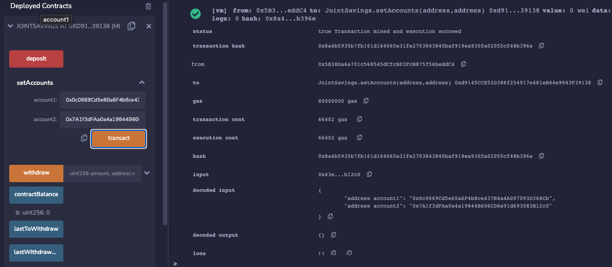

# How to interact with your Join Savings Smart Contract
Congratultions!  You're Joint Savings Smart Contract has been deployed and is now ready to use.  Here are some instructin and examples to help you learn more about interacting with your contract:
 
 

## Set Accounts

Use the `setAccounts` function to define the authorized Ethereum address that will be able to withdraw funds from your contract.

 

>**EXAMPLE:** Below we used two dummy addresses to show the functinality:    

 
 

## Deposit
Use the `deposit` functionality of the smart contract by sending funds to the smart contract.

> **EXAMPLE:** Below we are sending 1 ether as wei:    
> 

 
 

## Contract Balance
 Use the `contractBalance` function to verify the balance of the:

> **EXAMPLE 1:** Below we sent 1 ether as wei:    

 

> **EXAMPLE 2:** Below we sent 10 ether as wei:    

 

> **EXAMPLE 3:** Below we sent 5 ether:     

    Note: Remembering how to convert ether to wei and vice versa can be challenging. So, you can use a website like [Ethereum Unit Converter](https://eth-converter.com/) to ease doing the conversion.
 
 

## Withdraw

Use the `withdraw` function withdraw funds from the smart contract and deposit into anothe wallet.

 

 > **EXAMPLE 1:** Withdrawing 5 ether into `accountOne`:  
  

   
Now let's use the `contractBalance` function check the smart contrat balance to see the funds were withdrawn:

 

 
  

 > **EXAMPLE 2:** Withdrawing 10 ether into `accountTwo`:
  

   
Now let's use the `contractBalance` function check the smart contrat balance to see the funds were withdrawn:

   
Now let's use the `lastToWithdraw` function to see which address was the last one to make a withdraw:

   
Now let's use the `lastWithdrawAmount` function to see the amount of the last withdraw:

 
 

## Last Address to Withdraw
Use the `lastToWithdraw` function to see the address of the last wallet to withdraw.
   

 > **EXAMPLE:** Withdrawing 10 ether into `accountTwo`:
  

   

## Last Withdraw Amount

 > **EXAMPLE:** Withdrawing 10 ether into `accountTwo`:
  

   

